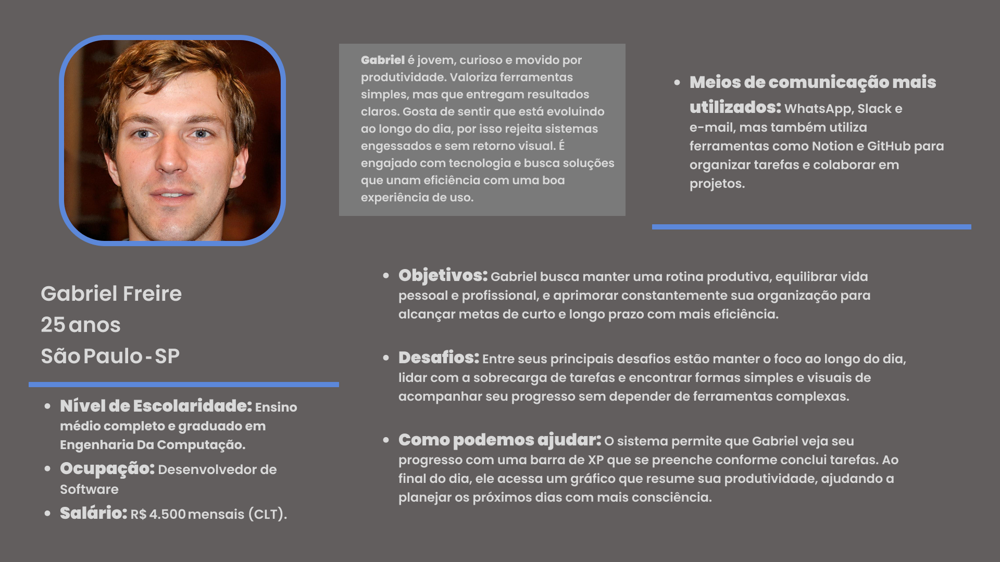

# Web Application Document - Projeto Individual - Módulo 2 - Inteli

## DayTrack
 
#### Autor do projeto: <a href="https://www.linkedin.com/in/enzo-piol-cerutti">Enzo Piol Cerutti</a> 

## Sumário

1. [Introdução](#c1)  
2. [Visão Geral da Aplicação Web](#c2)  
3. [Projeto Técnico da Aplicação Web](#c3)  
4. [Desenvolvimento da Aplicação Web](#c4)  
5. [Referências](#c5)  

 

## 1. Introdução 

Este projeto é um gerenciador de tarefas focado no planejamento diário e produtividade pessoal, criado para quem busca algo além de uma lista de afazeres. A proposta é simples, mas inovadora: o sistema não só organiza as tarefas do dia, mas também acompanha o progresso em tempo real e oferece um resumo visual de como o dia foi aproveitado.

O principal diferencial é a barra de XP, inspirada em mecânicas de jogos, que é preenchida à medida que as tarefas são concluídas. A lógica é simples: tarefas feitas divididas pelo total de tarefas, com uma barra animada que muda de cor conforme o progresso (de vermelho para verde).

Ao final do dia, o usuário recebe um gráfico de produtividade, mostrando a distribuição das tarefas por categoria (trabalho, estudos, lazer) e uma frase motivacional baseada no desempenho. Isso ajuda a entender os hábitos diários e a planejar melhor os próximos dias.

O sistema também armazena o histórico dos dias anteriores e funciona totalmente no navegador, utilizando tecnologias como HTML, CSS, JavaScript e armazenamento local. A proposta é uma solução prática, leve e com um toque de gamificação, tornando a organização do dia a dia mais envolvente.

---

## 2. Visão Geral da Aplicação Web

### 2.1. Personas 

Personas são perfis fictícios baseados em dados reais que representam usuários típicos de um sistema. Elas ajudam a entender melhor as motivações, necessidades e dores do público-alvo, facilitando decisões de design e desenvolvimento mais alinhadas com quem realmente vai usar o produto.

  FIGURA X - Persona 
   
  Fonte: Material produzido pelo autor, 2025

### 2.2. User Stories 

*Posicione aqui a lista de User Stories levantadas para o projeto. Siga o template de User Stories e utilize a referência USXX para numeração (US01, US02, US03, ...). Indique todas as User Stories mapeadas, mesmo aquelas que não forem implementadas ao longo do projeto. Não se esqueça de explicar o INVEST de 1 User Storie prioritária.*

---

## 3. Projeto da Aplicação Web

### 3.1. Modelagem do banco de dados  (Semana 3)

*Posicione aqui os diagramas de modelos relacionais do seu banco de dados, apresentando todos os esquemas de tabelas e suas relações. Utilize texto para complementar suas explicações, se necessário.*

*Posicione também o modelo físico com o Schema do BD (arquivo .sql)*

### 3.1.1 BD e Models (Semana 5)
*Descreva aqui os Models implementados no sistema web*

### 3.2. Arquitetura (Semana 5)

*Posicione aqui o diagrama de arquitetura da sua solução de aplicação web. Atualize sempre que necessário.*

**Instruções para criação do diagrama de arquitetura**  
- **Model**: A camada que lida com a lógica de negócios e interage com o banco de dados.
- **View**: A camada responsável pela interface de usuário.
- **Controller**: A camada que recebe as requisições, processa as ações e atualiza o modelo e a visualização.
  
*Adicione as setas e explicações sobre como os dados fluem entre o Model, Controller e View.*

### 3.3. Wireframes (Semana 03)

*Posicione aqui as imagens do wireframe construído para sua solução e, opcionalmente, o link para acesso (mantenha o link sempre público para visualização).*

### 3.4. Guia de estilos (Semana 05)

*Descreva aqui orientações gerais para o leitor sobre como utilizar os componentes do guia de estilos de sua solução.*

### 3.5. Protótipo de alta fidelidade (Semana 05)

*Posicione aqui algumas imagens demonstrativas de seu protótipo de alta fidelidade e o link para acesso ao protótipo completo (mantenha o link sempre público para visualização).*

### 3.6. WebAPI e endpoints (Semana 05)

*Utilize um link para outra página de documentação contendo a descrição completa de cada endpoint. Ou descreva aqui cada endpoint criado para seu sistema.*  

### 3.7 Interface e Navegação (Semana 07)

*Descreva e ilustre aqui o desenvolvimento do frontend do sistema web, explicando brevemente o que foi entregue em termos de código e sistema. Utilize prints de tela para ilustrar.*

---

## 4. Desenvolvimento da Aplicação Web (Semana 8)

### 4.1 Demonstração do Sistema Web (Semana 8)

*VIDEO: Insira o link do vídeo demonstrativo nesta seção*
*Descreva e ilustre aqui o desenvolvimento do sistema web completo, explicando brevemente o que foi entregue em termos de código e sistema. Utilize prints de tela para ilustrar.*

### 4.2 Conclusões e Trabalhos Futuros (Semana 8)

*Indique pontos fortes e pontos a melhorar de maneira geral.*
*Relacione também quaisquer outras ideias que você tenha para melhorias futuras.*

## 5. Referências

_Incluir as principais referências de seu projeto, para que seu parceiro possa consultar caso ele se interessar em aprofundar. Um exemplo de referência de livro e de site:_ 

---
---
